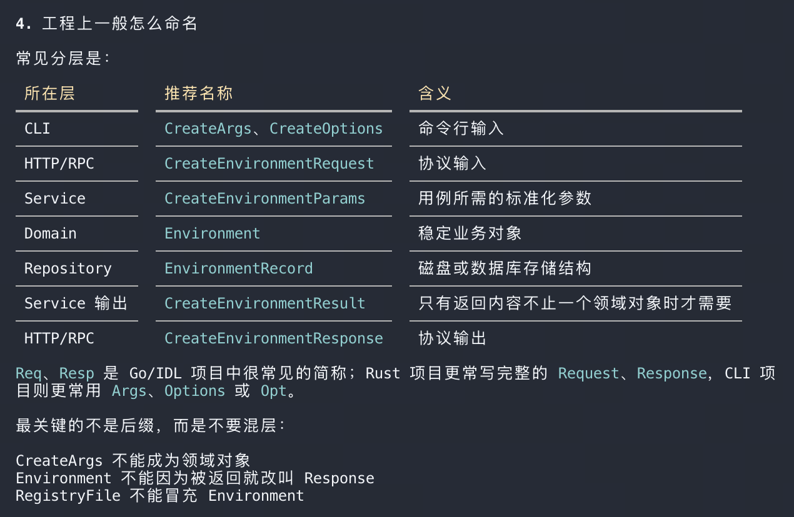
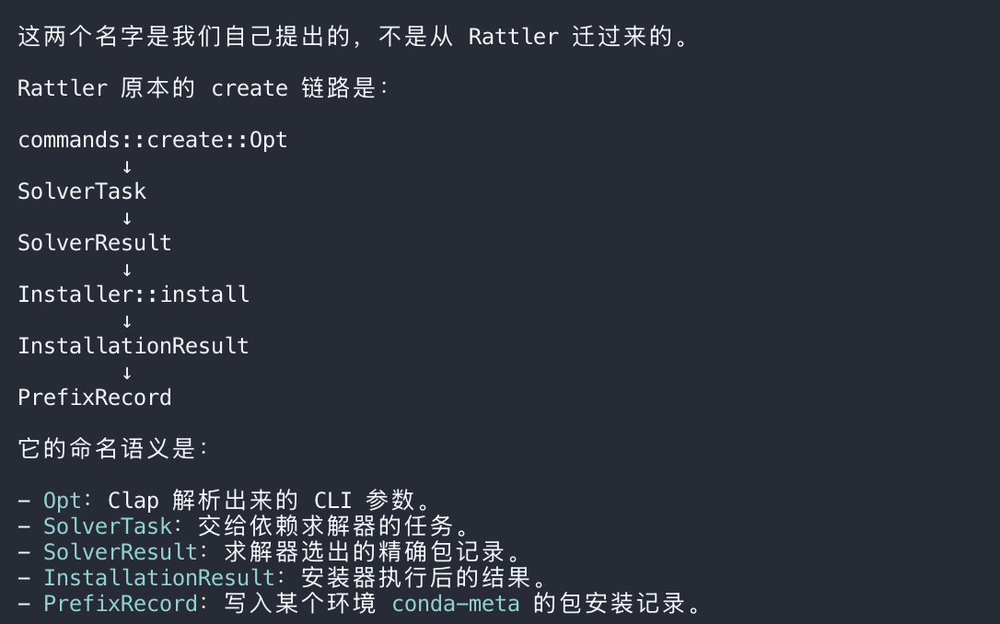
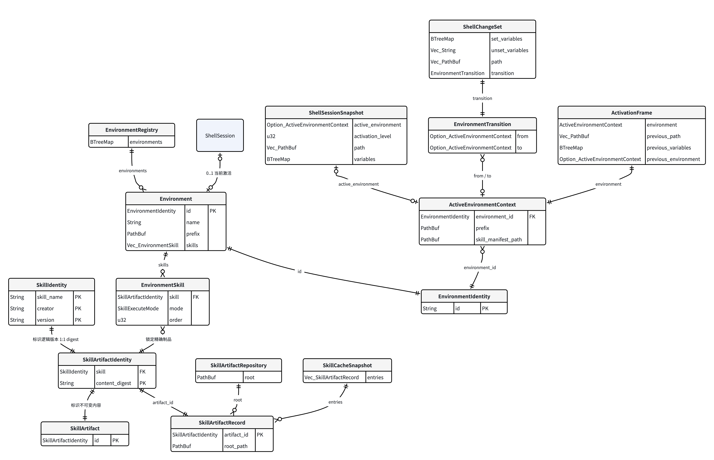

## 一、拓展性结构层次


1. **我还有一个要求：就是希望能控制skill的调用模式：**
   **例如auto，目前主流的模型自己识别判断**
   **还有固定频率，例如多少轮做一次（例如goodcase，badcase自动沉淀）**
   **还有始终，例如对每次对话整理知识库**
   **还有关闭**
   **并且这种status，是针对env维度的**
   **这个不属于env管理，就是同一个env下，更细颗粒度的配置机理**
   **可以做出一个更自动化、系统化好用的机制**

2. **提供一个cli cmd，强制允许本env调用别的env的skill，包括直接组合一个env**

3. **允许agent调用subagent装载env，平替agent身份设置**


因此对于Skill Model需要添加一个新的字段：Mode，
模型需要我们不断调查完善设计

## 二、总体模型设计

### 2.0 Referrence






完整的模型链应该是：

```
  CLI 输入模型
      ↓
  Application / Service 输入模型
      ↓
  Domain Model
      ↙                     ↘
  Repository 持久化模型      Runtime 输入/输出模型
      ↘                     ↙
  Application / Service 结果模型
      ↓
  CLI 输出模型
```

用业务 PSM 类比就是：

```
  IDL Req
  → Service Params
  → BO / Entity
  ↔ DO / PO、下游 RPC Req/Resp
  → Service Result
  → IDL Resp
```

注意：Service 和 Repository 是代码层；Input、Result、Record 等才是这些层持有或传递的模型。

**一、完整的模型分类**

| 模型层                       | CLI 项目命名        | 业务 PSM 类比   | 职责                           |
| ---------------------------- | ------------------- | --------------- | ------------------------------ |
| 外部输入                     | XxxArgs             | IDL Request     | 原样接收用户参数               |
| 应用输入                     | XxxInput            | Service Params  | 去掉 CLI 细节后的标准化输入    |
| 领域模型**(domain)**         | Environment         | BO / Entity     | 表示稳定业务对象               |
| 持久化模型<br />(repository) | EnvironmentRecord   | DO / PO         | 描述磁盘 JSON 的格式           |
| Runtime 输入                 | ActivationVariables | Caller Request  | 调用 shell/操作系统组件的参数  |
| Runtime 输出                 | ActivationResult    | Caller Response | shell/系统组件执行或计算的结果 |
| 应用结果                     | XxxResult           | Service Result  | 表示一次业务用例的完整结果     |
| CLI 输出                     | XxxOutput / XxxView | IDL Response    | 面向用户展示的数据             |

后缀语义可以这样记：

- Args      外部 CLI 参数
- Input     Service 接收的应用输入
- Entity    业务中的稳定对象
- Record    存储格式
- Result    Service 的执行结果
- Output    CLI 最终展示结构

**二、核心 Domain Model**

你的产品边界下，真正稳定的领域对象只有两个。

```
/// 一个由本应用管理的隔离环境。
pub struct Environment {
    /// 用户操作环境时使用的名称。
    pub name: String,
    /// 环境在磁盘上的根目录。
    pub prefix: PathBuf,
}
```

职责：

- 表示“一个环境是什么”；
- 被 create 产生；
- 被 env list 返回；
- 被 activate、switch 定位；
- 与包下载、shell 状态、CLI 参数无关。

```
/// 从一个环境中观察到的已安装包。
pub struct InstalledPackage {
    /// 包名。
    pub name: String,
    /// 已安装版本。
    pub version: String,
}
```

职责：

- 表示 list 查询到的包；
- 是当前环境实际状态的只读视图；
- 不表示用户期望安装什么；
- 不负责下载、解析或安装。

**三、create 的完整模型链**

**CLI 输入模型**

```
pub struct CreateEnvironmentArgs {
    /// 用户在命令行输入的环境名。
    pub name: String,
}
```

对应：

```
rattler env create demo
```

**Service 输入模型**

```
pub struct CreateEnvironmentInput {
    /// 校验、标准化之后的环境名。
    pub name: String,
}
```

它与 Args 目前字段相同，但语义不同：

- Args 属于 Clap；
- Input 属于应用用例；
- 以后换成 HTTP/RPC 时，Service 不需要依赖 Clap。

如果项目足够小，也可以暂时省略这个转换，直接使用 String。但从完整分层看，它处于这一位置。

**Runtime 输入模型**

```
pub struct CreatePrefixInput {
    /// 要创建环境的最终磁盘位置。
    pub prefix: PathBuf,
}
```

职责：

- 只告诉运行时“在哪里创建隔离环境”；
- 不包含环境名，因为 Python/操作系统不关心业务名称；
- 不包含包列表，因为用户自己执行 pip install。

**Domain Model**

物理环境创建成功后，Service 形成：

```
Environment {
    name: "demo",
    prefix: "/managed/envs/demo",
}
```

**Repository 持久化模型**

```
#[derive(Serialize, Deserialize)]
struct EnvironmentRecord {
    /// 写入 registry 的环境名。
    name: String,
    /// 写入 registry 的环境路径。
    prefix: PathBuf,
}

#[derive(Serialize, Deserialize)]
struct RegistryFile {
    /// 持久化格式版本，用于后续兼容升级。
    version: u32,
    /// 所有已登记环境。
    environments: Vec<EnvironmentRecord>,
}
```

它们属于 Repository 私有模型：

```
  Environment       业务对象
        ↕
  EnvironmentRecord 磁盘记录
```

**Service 结果模型**

```
pub struct CreateEnvironmentResult {
    /// 已创建并成功登记的环境。
    pub environment: Environment,
}
```

它表示整个用例已经成功： 物理环境创建成功 + registry 登记成功

**CLI 输出模型**

```
pub struct CreateEnvironmentOutput {
    /// 创建成功的环境名。
    pub name: String,
    /// 创建成功的环境路径。
    pub prefix: PathBuf,
}
```

完整链路只有模型，不用函数占位：

```
  CreateEnvironmentArgs
  → CreateEnvironmentInput
  → CreatePrefixInput
  → Environment
  → EnvironmentRecord / RegistryFile
  → CreateEnvironmentResult
  → CreateEnvironmentOutput
```

**四、env list 的完整模型链**

env list 没有实际输入参数，不需要为了形式硬造一个空 struct。

```
  RegistryFile
  → Vec<EnvironmentRecord>
  → Vec<Environment>
  → ListEnvironmentsResult
  → ListEnvironmentsOutput
```

**Service 结果：**

```
pub struct ListEnvironmentsResult {
    /// 所有由本应用管理的环境。
    pub environments: Vec<Environment>,
    /// 当前 shell 正在使用的环境路径，仅用于计算展示状态。
    pub active_prefix: Option<PathBuf>,
}
```

**CLI 输出：**

```
pub struct EnvironmentView {
    pub name: String,
    pub prefix: PathBuf,
    /// 只表示当前这次 CLI 调用所在 shell 是否激活了该环境。
    pub active: bool,
}

pub struct ListEnvironmentsOutput {
    pub environments: Vec<EnvironmentView>,
}
```

为什么 active 放在 EnvironmentView，不放 Environment？

因为：

- Environment 是全局稳定对象
- active 是当前 shell 下的临时展示状态

终端 A 可能激活 demo，终端 B 没有激活。环境自身不能有全局 active: bool。

**五、list 包列表的完整模型链**

**CLI 输入：**

```
pub struct ListPackagesArgs {
    /// 用户输入的环境名。
    pub environment: String,
}
```

**Service 输入：**

```
pub struct ListPackagesInput {
    /// 标准化后的目标环境名。
    pub environment_name: String,
}
```

Repository 中先读取环境：

```
  EnvironmentRecord
  → Environment
```

然后读取 pip 输出。如果通过：

```
python -m pip list --format=json
```

那么适配器内部可以有：

```
#[derive(Deserialize)]
struct PipPackageRecord {
    name: String,
    version: String,
}
```

再转换成 Domain：

```
  PipPackageRecord
  → InstalledPackage
```

**Service 结果：**

```
pub struct ListPackagesResult {
    /// 被查询的环境。
    pub environment: Environment,
    /// 该环境实际安装的包。
    pub packages: Vec<InstalledPackage>,
}
```

**CLI 输出：**

```
pub struct InstalledPackageView {
    pub name: String,
    pub version: String,
}

pub struct ListPackagesOutput {
    pub environment_name: String,
    pub packages: Vec<InstalledPackageView>,
}
```

完整模型链：

```
  ListPackagesArgs
  → ListPackagesInput
  → EnvironmentRecord
  → Environment
  → PipPackageRecord
  → InstalledPackage
  → ListPackagesResult
  → ListPackagesOutput
```

**六、activate 的完整模型链**

**CLI 输入：**

```
pub struct ActivateEnvironmentArgs {
    /// 要激活的环境名。
    pub environment: String,
    /// 用户显式指定的 shell；未指定时自动检测。
    pub shell: Option<String>,
}
```

**Service 输入：**

```
pub struct ActivateEnvironmentInput {
    pub environment_name: String,
    pub shell: String,
}
```

Repository 读取：

```
  EnvironmentRecord
  → Environment
```

Runtime 输入模型就是现有的 ActivationVariables，它应该留在 runtime，而不是 Domain：

```
pub struct ActivationVariables {
    /// 当前 shell 已激活的 prefix。
    pub conda_prefix: Option<PathBuf>,
    /// 当前 PATH。
    pub path: Option<Vec<PathBuf>>,
    /// 当前环境变量。
    pub current_env: HashMap<String, String>,
}
```

再组合出激活请求：

```
pub struct ActivationRequest {
    /// 要激活的目标环境。
    pub target: Environment,
    /// 当前 shell 状态。
    pub current_shell: ActivationVariables,
    /// 目标 shell 类型。
    pub shell: String,
}
```

**Runtime 输出：**

```
pub struct RenderedShellScript {
    /// 需要由当前 shell 执行的脚本文本。
    pub contents: String,
}
```

**Service 结果：**

```
pub struct ShellTransitionResult {
    /// 切换前的环境；此前没有环境时为空。
    pub from: Option<Environment>,
    /// 切换后的环境；退出环境时为空。
    pub to: Option<Environment>,
    /// 调用方需要执行的 shell 脚本。
    pub script: RenderedShellScript,
}
```

CLI 最终必须原样输出 shell 脚本，所以不需要再包一层 ActivateResponse：

```
  ActivateEnvironmentArgs
  → ActivateEnvironmentInput
  → EnvironmentRecord
  → Environment
  → ActivationVariables
  → ActivationRequest
  → RenderedShellScript
  → ShellTransitionResult
  → stdout
```

**七、deactivate 的完整模型链**

**CLI 输入：**

```
pub struct DeactivateEnvironmentArgs {
    pub shell: Option<String>,
}
```

**Service 输入：**

```
pub struct DeactivateEnvironmentInput {
    pub shell: String,
}
```

它不需要环境名，因为当前环境来自：

- CONDA_PREFIX
- CONDA_SHLVL
- CONDA_ENV_SHLVL_*

**Runtime 输入：**

```
pub struct DeactivationRequest {
    /// 当前 shell 状态及激活层级。
    pub current_shell: ActivationVariables,
    /// 目标 shell 类型。
    pub shell: String,
}
```

输出继续复用： `RenderedShellScript`

```
ShellTransitionResult {
    from: Some(current),
    to: previous_or_none,
    script,
}
```

完整模型链：

```
  DeactivateEnvironmentArgs
  → DeactivateEnvironmentInput
  → ActivationVariables
  → DeactivationRequest
  → RenderedShellScript
  → ShellTransitionResult
  → stdout
```

**八、switch env 的完整模型链**

**CLI 输入：**

```
pub struct SwitchEnvironmentArgs {
    pub target_environment: String,
    pub shell: Option<String>,
}
```

**Service 输入：**

```
pub struct SwitchEnvironmentInput {
    pub target_environment_name: String,
    pub shell: String,
}
```

中间模型可以全部复用：

```
  目标 EnvironmentRecord
  → 目标 Environment
  当前 ActivationVariables
  → ActivationRequest
  → RenderedShellScript
  → ShellTransitionResult
```

结果：

```
ShellTransitionResult {
    from: Some(old_environment),
    to: Some(new_environment),
    script,
}
```

所以 switch 需要自己的 Input，但不需要重新造一套 Domain Model 或 Runtime Model。

**最终目录应该体现模型属于哪一层**

```
src/
├── command/
│   ├── create.rs          # CreateEnvironmentArgs / Output
│   ├── env_list.rs        # ListEnvironmentsOutput
│   ├── list.rs            # ListPackagesArgs / Output
│   ├── activate.rs        # ActivateEnvironmentArgs
│   ├── deactivate.rs      # DeactivateEnvironmentArgs
│   └── switch.rs          # SwitchEnvironmentArgs
│
├── application/
│   └── environment.rs     # XxxInput / XxxResult
│
├── model/
│   ├── environment.rs     # Environment
│   └── installed_package.rs
│
├── repository/
│   ├── environment_registry.rs
│   │                      # RegistryFile / EnvironmentRecord
│   └── pip_metadata.rs    # PipPackageRecord
│
└── runtime/
    └── activation.rs      # ActivationVariables
                           # ActivationRequest
                           # DeactivationRequest
                           # RenderedShellScript
```

**最终要点是：**

- Args        外部用户说了什么
- Input       应用理解成了什么
- Domain      我们管理的对象是什么
- Record      这个对象怎么落盘
- Runtime DTO 操作系统组件需要什么、产出什么
- Result      这次业务操作得到了什么
- Output      最终给用户展示什么

“完整模型层次”不表示每一层必须机械复制相同字段。只有边界语义确实不同才拆 struct；没有输入的 env list 不必造空模型，直接复用 Environment 也不必再包一层同构 BO。


## 三、模型设计

> 感谢孤独摇滚赞助的所有live小曲完善设计
> 命名可能需要修改

### 3.1 Skill关键 domain model

1. `SkillSharedCache`
   存储真实Skill实际数据
   （原本的Skill存储规则可以不破坏，而是额外维护另外一套策略逻辑利用原本存储，即作为`SkillSharedCache`），
   环境通过传递`SkillIdentity`来获取真实的`SkillData`数据

   ```go
   var skil_list map[SkillIdentity] [Skill] {}{}
   
   
   ```

​	

2. `SkillManagement`
   抽象的**宏观**Skill 逻辑管理model

   ```go
   //var belong_envs Environment[]作废，无法保留skill在当前env的特征
   //用于查询真实Data，标识当前skill在当前环境管理器的身份
   var id SkillIdentity
   var env_skills EnvironmentSkill[]
   ```

   
   
3. `EnvironmentSkill`
   抽象的在具体环境里**具体**Skill的特性model

   ```go
   var id SkillIdentity
   var mode SkillExecuteMode
   ```

   

4. `SkillData`
   持久化，略

   

5. `SkillIdentity`
   一个Skill的唯一识别Key，PK

   ```go
   var skill_name string
   var creator string
   var version string
   ```

   

### 3.2 Environment关键domain model


1. `EnvironmentRegistry`
   宏观的所有环境管理model，维护所有env info

   ```go
   var envs map[EnvIndentity][Environment]
   ```

   

   

2. `Environment`
   具体的环境要素

   ```go
   var skill_list [SkillManagement]
   //环境对应的路径，路径存储的是skill context注入逻辑，
   //用此来做到“隔离”
   var prefix string
   ```

   

3. 

   

   

### 3.3 ref ER图

https://dcar.feishu.cn/docx/YaBwdF1yroAfEIxL1tXc4Nz0nIg




## 四、接口设计

Args（即对应互联网开发HTTP层）设计：
模仿：conda，help Args省略。

项目最终名称确定为 hev。
```bash
# env
/hev env -c/create <env-name>
/hev env -rm/remove <env-name>
/hev env list
/hev env -rn/rename <old-env-name> <new-env-name>
/hev env -a/activate <env-name>
#只能取消当前环境；base取消即退出hev模式，回到普通没有hev的模式
/hev env -d/deactivate

# skill
/hev (skill) list <default Args: cur-env/env-name>
/hev skill list -a #查看所有skill
# 没想好分配skill到某个env的cmd
/hev skill
# 没想好查看skill归属有的env的cmd
/hev skill
# 还有一些功能的cmd没想出来就是如下的相关内容，但是应该先把隔离做出来，就是以上最基本的
# 项目与 CLI 的最终名称均为 hev；内部实现仍与命令名解耦。
/hev skill

```

**这个接口设计的话，我们先做一个最简单的：**                                                                                                                                                    

  **create env、skill添加到 env、activate env**     

就不用纠结别的命名了，先围绕这个开发

> 1. **提供一个cli cmd，强制允许本env调用别的env的skill，包括直接组合一个env**
>
> 2. **允许agent调用subagent装载env，平替agent身份设置**
